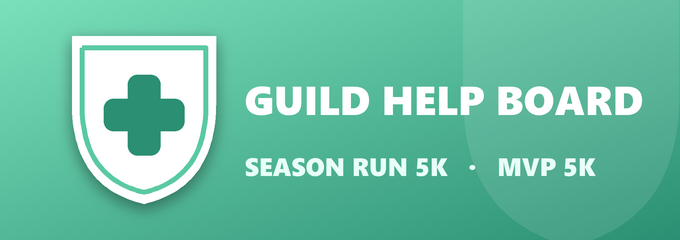

<p align="center">
  
</p>

# Guild Help Board Bot

Tracks members who need help hitting **Season Run 5K** or **MVP 5K**, and
lets officers mark them as sorted once helped. Posts a live, auto-updating
board message in a channel of your choice.

For a player-facing guide to the commands, see **[USAGE.md](USAGE.md)** (or
run `/help` in Discord).

## Commands

| Command | Who can use it | What it does |
|---|---|---|
| `/needhelp category:[seasonrun5k/mvp5k] note:optional` | Anyone | Adds you to the board (and posts a request card officers can action) |
| `/imsorted category:[optional]` | Anyone | Removes yourself once you've been helped |
| `/stats` | Anyone | Navigable stats panel (private): current season, all-time, any past season, or one member's help — top helpers, per-category, demand |
| `/help` | Anyone | Shows the command list (private reply) |
| `/helped member:@user category:[…]` | Officers | Marks that member as sorted (also DMs them) |
| `/remove member:@user category:[…]` | Officers | Removes an entry without marking it done (fixes mistakes) |
| `/board` | Officers | Posts the live board in the current channel and pins it |
| `/reset` | Officers | Quick-closes the board for a new season (asks to confirm; archives the totals for `/stats`) |
| `/season` | Officers | Season control panel: start a new **named** season, rename the current or a past one |
| `/config addrole\|removerole\|roles\|notify\|category\|nudge` | Admins (Manage Server) | Manager roles, request-ping settings, board categories, stale-request nudges |

**Stale nudges** (off by default): `/config nudge set #channel [hours]` posts a
once-a-day reminder digest for requests waiting longer than the threshold
(default 48h), pinging the notify role once. It only reminds — it never removes
anything. `/config nudge off` and `/config nudge status` manage it.

Officers can also resolve a request without typing: every `/needhelp` posts a
card with **✅ Sorted** / **🗑️ Remove** buttons. Clicking updates the card, the
board, and DMs the member.

Most commands now open **interactive panels** when run with no options — pick from
menus instead of typing ids: `/imsorted` lists your own open requests to close;
`/helped` and `/remove` let you pick the member then their waiting request (no
dead-ends); `/config roles` manages manager/notify roles with role pickers;
`/config category add` opens a form; `/reset` asks you to confirm before wiping.
The typed forms still work as fast-paths.

### Who counts as an "officer"

The officer actions (the buttons, `/helped`, `/remove`, `/board`, `/reset`) can
be used by:

- anyone with the **Manage Server** permission, **or**
- anyone holding a role that an admin added with `/config addrole @Role`.

So an admin runs `/config addrole @Officers` and `/config addrole @LEADER`
once, and those roles can manage the board without needing Manage Server.
Until at least one manager role is set, only Manage Server can manage — you
can't lock yourself out. `/needhelp` and `/help` are open to everyone.

## 1. Create the Discord application

1. Go to https://discord.com/developers/applications → **New Application**
2. Name it (e.g. "Guild Help Board"), create it
3. Left sidebar → **Bot** → **Add Bot**
4. Under **Privileged Gateway Intents**, you don't need to enable any of them
   for this bot (it doesn't read message content)
5. Click **Reset Token** → copy the token → this is your `DISCORD_TOKEN`
6. Left sidebar → **General Information** → copy the **Application ID** →
   this is your `CLIENT_ID`

Optional: under **General Information** you can upload `assets/icon.png` as the
app icon and `assets/banner.png` (Bot tab) as the banner.

## 2. Get your server (guild) ID

In Discord, enable Developer Mode (User Settings → Advanced → Developer
Mode), then right-click your server icon → **Copy Server ID**. This is your
`GUILD_ID`.

## 3. Invite the bot to your server

Go to **OAuth2 → URL Generator** in the developer portal:
- Scopes: `bot`, `applications.commands`
- Bot permissions: `View Channel`, `Send Messages`, `Embed Links`,
  `Read Message History`, `Manage Messages` (the last is needed to pin the board)

Copy the generated URL, open it in your browser, and add the bot to your
server.

## 4. Run it locally (for testing)

```bash
cd guild-bot
cp .env.example .env
# paste your DISCORD_TOKEN, CLIENT_ID, GUILD_ID into .env
npm install
npm start
```

You should see `Slash commands registered.` and `Logged in as ...` in the
console. If an environment variable is missing, the bot exits with a clear
message telling you which one.

Then, in the Discord channel you want the board in, run `/board`. The bot
posts and pins an embed there — it updates automatically from then on.

## Keep your token safe

Your `DISCORD_TOKEN` is a password for the bot — anyone who has it can take it
over. The included `.gitignore` keeps `.env` (your token) and `data.json` out
of Git, so pushing this folder to GitHub is safe. Do **not** remove those
lines from `.gitignore`, and never paste your token into a message, issue, or
commit. If it ever leaks, click **Reset Token** in the Discord developer
portal immediately.

## Hosting it 24/7

`npm start` on your own computer only runs while that computer is on. To keep
the bot up all the time, deploy it to an always-on host.

### Option A — TrueNAS SCALE (Docker custom app)

This is the setup this repo is deployed with. It clones the code fresh on each
start (so restarting the app = pulling the latest code) and keeps `data.json`
on a dataset so it survives restarts.

1. **Create a dataset** for the bot, e.g. `Tank/guild-bot` (mountpoint
   `/mnt/Tank/guild-bot`). This holds `data.json`.
2. **Apps → Discover Apps → (⋮) → Install via YAML**, name it `guild-bot`,
   and paste the compose below. Replace the three `PASTE_…` values with your
   real token/IDs, and fix the pool path and repo URL if yours differ:

   ```yaml
   services:
     guild-bot:
       image: node:20
       container_name: guild-help-board-bot
       restart: unless-stopped
       environment:
         DISCORD_TOKEN: "PASTE_YOUR_TOKEN_HERE"
         CLIENT_ID: "PASTE_YOUR_CLIENT_ID_HERE"
         GUILD_ID: "PASTE_YOUR_GUILD_ID_HERE"
         DATA_DIR: "/data"
       volumes:
         - /mnt/Tank/guild-bot:/data
       command:
         - sh
         - -c
         - "rm -rf /app && git clone --depth 1 https://github.com/damndotrun/guild-help-board-bot /app && cd /app && npm install --omit=dev && node index.js"
   ```

3. **Install**, then check the container **Logs** for `Slash commands
   registered.` and `Logged in as …`.
4. **To update later:** push new code to the repo, then **Restart** the app —
   it re-clones the latest `main`. `data.json` is untouched on the dataset.

> Run only **one** instance of the bot. Multiple instances sharing one
> `data.json` (e.g. `pm2` cluster mode, or a second copy elsewhere) can
> overwrite each other.

> **⚠️ Don't roll back to a version older than the current release.** The
> bot only keeps the `data.json` fields it knows about when it saves. Later
> builds added fields the older ones don't recognise — the append-only `records`
> log (helper-stats) and the stale-nudge settings (`nudgeChannelId`,
> `nudgeThresholdHours`, `lastNudgeTs`). Starting an older build against that
> same file drops those fields on its first save. If you must roll back, restore
> `data.json` from the `data.json.bak` sidecar first (or keep a copy).

### Option B — Railway / Render / VPS

- **Railway** (https://railway.app) — connect the GitHub repo, set
  `DISCORD_TOKEN` / `CLIENT_ID` / `GUILD_ID` as variables, deploy.
- **Render** (https://render.com) — "Background Worker" service, same variables.
- A cheap VPS with `pm2` (`npm i -g pm2 && pm2 start index.js`) also works.

On hosts with an ephemeral filesystem, set `DATA_DIR` to a persistent volume
so `data.json` survives restarts.

## Data

Entries are stored in `data.json`. By default it sits next to `index.js`; set
the `DATA_DIR` environment variable to keep it on a persistent volume instead
(as the TrueNAS setup above does). Writes are atomic, and a corrupt file is
detected and recovered from rather than crashing the bot.
